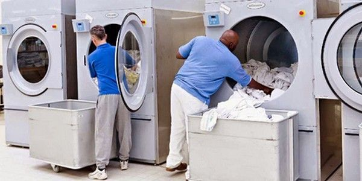
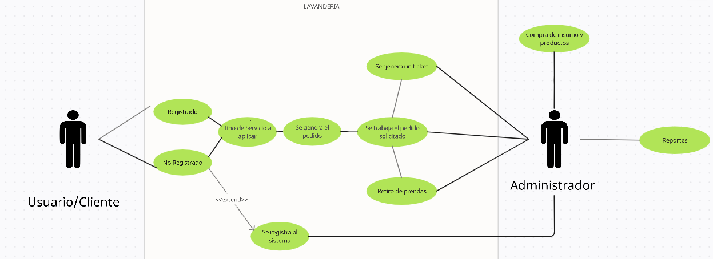
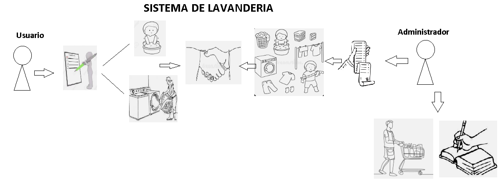
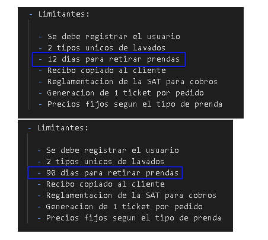
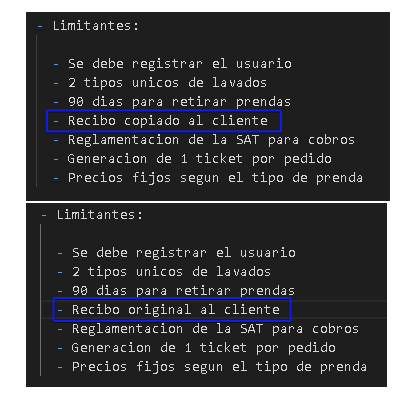

# Definicion de Requerimientos

```
En esta etapa del proyecto se desarollara detalladamente los requerimientos y analisis para resolver nuestro problema planteado, por medio de varias tareas principales, las cuales son:
```

## 1. Iniciacion _(Inception)_

```
Aqui estaremos planteando preguntas generales al cliente para entender el problema, brindar una solucion y establecer la comunicacion mas efectiva entre los desarolladores y el consumidor.
```

- Preguntas hacia el cliente

  - ¿Que servicio ofrecen como organizacion?
  - ¿Cuales son los tipos de servicios que ofrecen?
  - ¿Registran a los clientes en algun sistema interno?
  - ¿Clasifican los perdidos por cliente?
  - ¿Informan al cliente de los precios por servicio?
  - ¿Cuales son los precios por tipo de servicio?
  - ¿Generan algun tipo de ticket para cobrar el servicio brindado?
  - ¿Utilizan reglamentaciones de la SAT?
  - ¿Que pasa si un cliente no retira su pertenencias?
  - ¿Cada cuanto se abastecen de insumos y productos?
  - ¿Necesitan generar reportes para llevar un control interno?

    

## 2. Obtencion _(Elicitation)_

```
Aqui se definen formalmente los requerimientos por medio de la recopilacion de informacion. La tecnica que usaremos es Observacion in situ, ya que observaremos fisicamente las practicas que realizan habitualmente en la organizacion.
```



```
Luego de observar a los empleados se logro definir con exactitud los requerimientos, los cuales son:
```

- La empresa es una lavenderia

* Se ofrecen 2 tipos de servicios
  - Lavado en seco
  - Lavado con maquina
* Al momento de llegar un cliente se valida si esta registrado o no en el sistema
* Se consulta al cliente tipo de servicio que desea
* El encargado realiza el lavado segun lo solicitado por cliente
* Se emite un ticket y se cobra el servicio
* Se le indica la fecha de retiro al cliente (se pacta)
* Semanalmente compran insumos
* Mensualmente se genera un reporte
* Precios de lavados segun su tipo:

  | Tipo de Servicio | Blusa | Acolchado |
  | ---------------- | ----- | --------- |
  | Lavado a Seco    | Q150  | Q380      |
  | Maquina Lavador  | Q110  | Q300      |

## 3. Elaboracion

```
En esta parte expanderemos la informacion obtenida en la iniciacion, por medio de funciones y comportamientos modelados a traves de un diagrama de caso de uso:
```



## 4. Espesificacion

```
Esta tarea describe la funcion y desempeño de un sistema y las restricciones que tiene, en este esceneario puntual utilizaremos la tecnica de dibujos para representar lo antes mencionado:
```



- Limitantes:

  - Se debe registrar el usuario
  - 2 tipos unicos de lavados
  - 90 dias para retirar prendas
  - Recibo original al cliente
  - Reglamentacion de la SAT para cobros
  - Generacion de 1 ticket por pedido
  - Precios fijos segun el tipo de prenda

## 5. Validacion

```
Evaluaremos la congruencia y calidad para asegurarnos que la espesificacion concuerda con las expectativas del usuario y que no es ambigua, tambien se detectaran errores, por medio de la revision tecnica formal.
```

- **Errores detectados**
  - Dias para retirar prenda no son 12 sino 90 dias (se corrige)
    
  * El recibo que se brinda al cilente es el original no la copia (se corrige)
    

* **Espesificaciones NO concuerdan que lo que el cliente necesita, se detalla a continuacion:**

  - Cliente desea facturar por medio de las reglamentaciones de la SAT y pago a contado (se corrigue)

#

**_Luego de esto se logra determinar que todo funciona correctamente y se tiene el visto bueno del cliente._**

## 6. Roles

1. Bryan Recinos (PM)
2. Estuardo Lopez y Kimberly Salazar (Implementador, desarollador)
