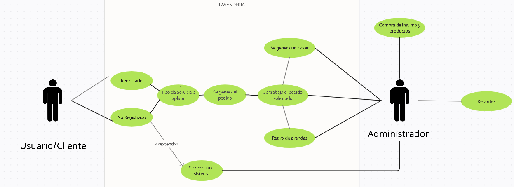

# Definicion de Requerimientos

```
En esta etapa inicial se plantearan los requeriminetos del proyecto y se analizaran cada uno de ellos para llegar a la solucion mas adecuada para nuestro cliente.
```

**Por medio de entrevisastas, preguntas generales y ver trabajar en sitio al cliente se logro determinar el giro de su organizacion y funciones principales:**

1. ¿Que servicio ofrecen como organizacion?

- Lavenderia

2. ¿Tipos de servicios que ofrecen?

- Lavado en Seco
- Lavado con maquina

3. El usuario debe ser registrado en el sistema siempre antes de solicitar algun servicio con los siguiente datos:

- Apellido y nombre
- Domicilio
- Calle, numero, apartamento y piso
- Barrio y telefono

4. Se genera un pedido segun el tipo de servicio solicitado por el usuario con los siguientes datos:

- Numero de pedido
- Fecha de pedido
- Tipos de prenda
- Tipo de servicio por prenda
- Cantidad de prendas
- Fecha pautada para devolucion

5. Usuario llega a retirar pedido, se le brinda lo siguiente:

- Un ticket y se cobra el servicio prestado

* Usuario tiene 90 dias para retirar sus prendas

6. Cliente debe comprar insumos y productos para su lavanderia

7. Cliente debe generar reportes formales con los tipos de lavado mas solicitados

**Lo cual representado por medio de un diagrama de clase de uso, queda de la siguiente manera:**



**Ahora los requerimientos puntuales del cliente segun cada inciso y su analisis, son los siguientes:**

## iniciso #3

Cliente solicita una aplicacion web con una base de datos para registrar a sus usuarios en el sistema

**Analisis:**

- Debe haber un cuadro de texto para ingresar la informacion necesaria
- Se debe generar un ID para cada usuario
- Debe existir un boton para limpirar, registrar, cancelar
- Debe haber boton para buscar usuarios ya registrados
- Se debe guardar la fecha en la que se ingreso un usuario al sistema

* Si ya existe registrado un usuario alertar con un mensaje y no permitir registrarlo nuevamente

## Inciso #4

Cliente solicita una aplicacion web con una base de datos, para llenar el formulario y generar los pedidos por usuario

**Analisis:**

- Debe haber un cuadro de texto para ingresar la informacion necesaria
- Debe existir un boton para limpirar, generar pedido, cancelar

* Debe exitir un boton para ver pedidos ya generados
* Los pedidos tendran un numero de 8 caracteres que se generan en secuencia del 1 hasta el 99999999
* El formato de fecha sera dia/mes/año
* El formato de horario sera 12hrs

## Inciso #5

Cliente solicita una aplicacion web con una base de datos, para generar los tickets e ingresar los cobros realizados

**Analisis:**

- Los tickets tendran un numero de 8 caracteres que se generan en secuencia del 1 hasta el 99999999
- Debe existir un boton para generar ticket, cancelar
- Debe haber boton para buscar ticekts ya generados
- Si el ticket lleva mas de 90 dias sin ser cerrado notificara al administrador y lo cerrara automaticamente
- Los tickets se guardan maximo 1 año de antiguedad

## Inciso #7

Cliente solicita una aplicacion web con una base de datos para realizar reporteria mensual.

**Analisis:**

- Debe existir un boton para generar reporte
- Se puede agregar los campos que deseamos tener en el reporte como (Usuario - Fecha - Ticket)
- Debe haber un boton para generar reporte, ver reportes anterior
- El formato del reporte sera PDF
- Se debe ingresar usuario y contraseña para acceder al apartado de reporteria
