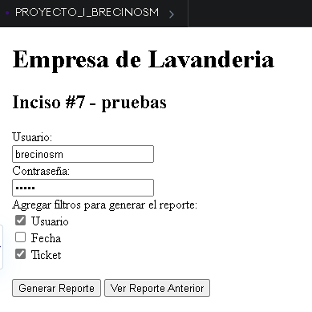

# Pruebas

```
En esta etapa se incluye la integracion del software en el entorno seleccionado, que nuestro caso es una aplicacion web. Esto esta enfocado para el cliente final y asi determinar si el sotfware cumple con sus espectativas.
```

## Inciso #3 - Pruebas en la aplicacion web solicitada por cliente y su analisis

```html
<!DOCTYPE html>
<html lang="en">
  <head>
    <meta charset="UTF-8" />
    <title>PROYECTO_I_BRECINOSM</title>
    <link rel="stylesheet" href="style.css" />
  </head>

  <body>
    <h1>Empresa de Lavanderia</h1>
    <h2>Inciso #3 - pruebas</h2>

    <label>Nombre y Apellido:</label>
    <br />
    <input type="text" />
    <br />
    <label for="domicilio">Domicilio:</label>
    <br />
    <input type="text" />
    <br />
    <label>Direccion (Calle, numero, apartamento y piso):</label>
    <br />
    <input type="text" />
    <br />
    <label>Barrio y Telefono:</label>
    <br />
    <input type="text" />
    <br />
    <br />
    <button>Limpiar</button>
    <button>Registrar</button>
    <button>Cancelar</button>
    <button>Buscar Usuarios ya Registrados</button>

    <script src="script.js"></script>
  </body>
</html>
```


## Inciso #4 - Pruebas en la aplicacion web solicitada por cliente y su analisis

```html
<!DOCTYPE html>
<html lang="en">
  <head>
    <meta charset="UTF-8" />
    <title>PROYECTO_I_BRECINOSM</title>
    <link rel="stylesheet" href="style.css" />
  </head>

  <body>
    <h1>Empresa de Lavanderia</h1>
    <h2>Inciso #4 - pruebas</h2>

    <label>Numero de pedido: </label>
    <label> 00000001</label>
    <br />
    <label for="fecha">Fecha del pedido: </label>
    <label> 20/03/2023</label>
    <br />
    <label for="lavado">Tipo de lavado por prenda: </label>
    <br />
    <label><input type="checkbox" /> Lavado en seco </label><br />
    <label><input type="checkbox" /> Lavado con maquina </label><br />
    <label for="cantidad">Cantidad de prenda: </label>
    <br />
    <input type="text" />
    <br />
    <label for="fecha2">Fecha pautada para devolucion: </label>
    <label> 25/03/2023</label>
    <br />
    <br />
    <button>Limpiar</button>
    <button>Generar pedido</button>
    <button>Cancelar</button>
    <button>Buscar pedidos ya generados</button>

    <script src="script.js"></script>
  </body>
</html>
```


## Inciso #5 - Pruebas en la aplicacion web solicitada por cliente y su analisis

```html
<!DOCTYPE html>
<html lang="en">
  <head>
    <meta charset="UTF-8" />
    <title>PROYECTO_I_BRECINOSM</title>
    <link rel="stylesheet" href="style.css" />
  </head>

  <body>
    <h1>Empresa de Lavanderia</h1>
    <h2>Inciso #5 - pruebas</h2>

    <label for="ticket">No. de Ticket: </label>
    <label> 00000001</label>
    <br />
    <br />
    <button>Generar Ticket</button>
    <button>Cancelar</button>
    <button>Buscar Tickets ya generados</button>

    <script src="script.js"></script>
  </body>
</html>
```


## Inciso #7 - Pruebas en la aplicacion web solicitada por cliente y su analisis

```html
<!DOCTYPE html>
<html lang="en">
  <head>
    <meta charset="UTF-8" />
    <title>PROYECTO_I_BRECINOSM</title>
    <link rel="stylesheet" href="style.css" />
  </head>

  <body>
    <h1>Empresa de Lavanderia</h1>
    <h2>Inciso #7 - pruebas</h2>
    <label for="usuario">Usuario: </label>
    <br />
    <input type="text" />
    <br />
    <label for="contraseña">Contraseña: </label>
    <br />
    <input type="password" />
    <br />
    <label for="filtro">Agregar filtros para generar el reporte: </label>
    <br />
    <label><input type="checkbox" /> Usuario </label><br />
    <label><input type="checkbox" /> Fecha </label><br />
    <label><input type="checkbox" /> Ticket </label><br />
    <button>Generar Reporte</button>
    <button>Ver Reporte Anterior</button>

    <script src="script.js"></script>
  </body>
</html>
```



**Se logro ejecutar el software solicitado por el cliente y todo funciona segun lo requerido, se adjunta el codigo fuente y su respectiva prueba en produccion para usuarios finales, cliente queda satisfecho**
