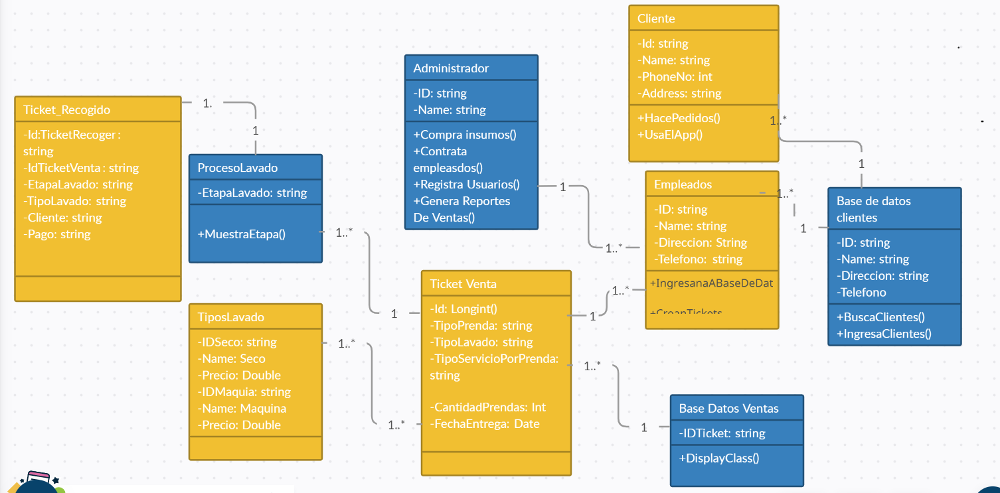
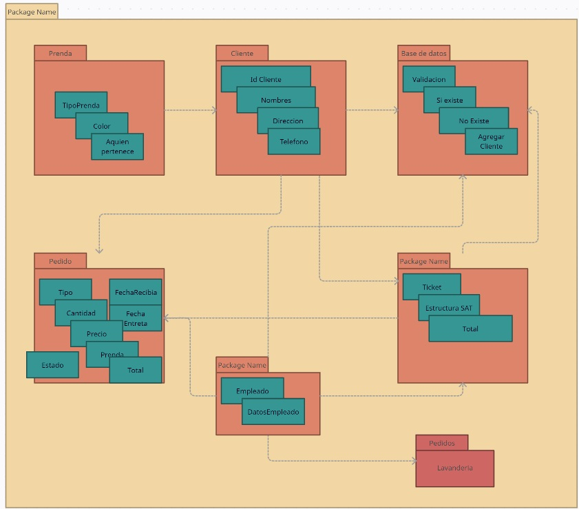
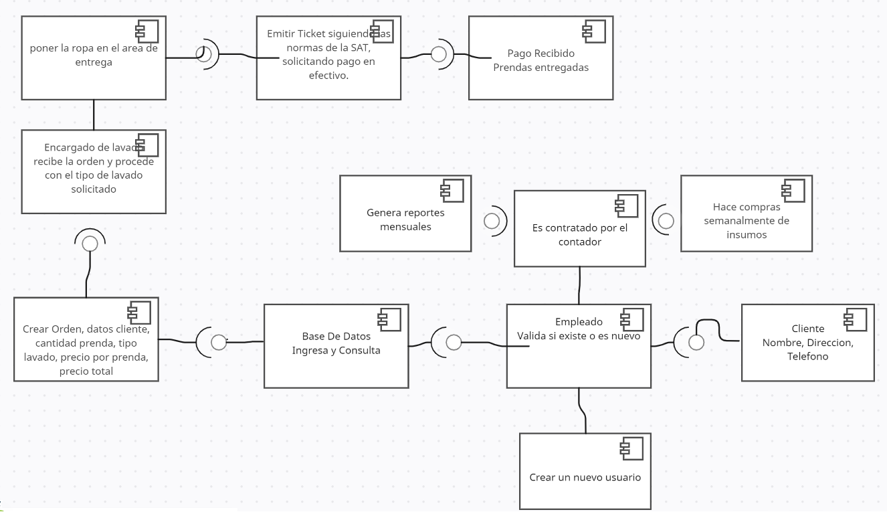
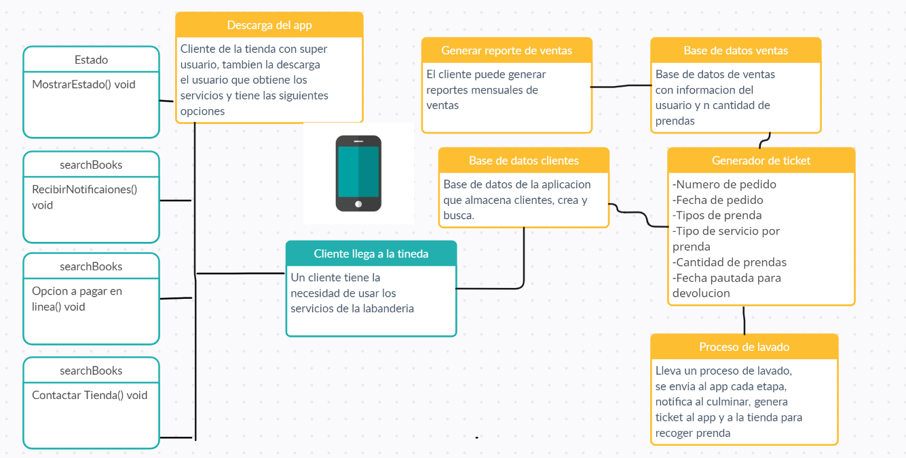

### Documentar el diseño de la aplicación  

# diseño de la aplicación
~~~
El diseño de datos consiste en descubrir y definir completamente los proceso y características de los datos de la aplicación. Es un proceso de perfeccionamiento gradual que abarca las situaciones más simples como por ejemplo ¿Qué datos requieren la aplicación? ¿Cómo se accederán a esos datos? ¿Cómo se almacenarán los datos?. Si se logra un diseño de datos bueno el acceso a los datos de la aplicación será rápido y fácil de mantener y podrá aceptar sin problemas las futuras mejoras de los datos
~~~
## Diseño de datos y/o de clases

#

### Modelo Base De Datos Clientes
|   Id_Cliente	|   Apellido_Nombre |   Domicilio   |   Barrio	|   Telefono    |
|---------|---------------|-----------|---------------|----------|
|A36-45	|Perez Juan	|36 calle, numero 6, apt b, piso 7	|Milagro	|54223632|
|A36-46	|Solorzano Melany	|25 calle, numero 3, apt c2, piso 2	|Santa Fe	|45552322|
|A36-47	|Monzon Raul	|14 calle, numero 2, apt 23, piso 3	|Rosalias	|51225688|
|A36-48	|Lopez Santiago|	15 calle, numero 2, apt 23, piso 3|	Montufar	|53154548|
|A36-49|	Batres Jeniffer	|16 calle, numero 2, apt 23, piso 3	|Obelisco	|53226363|

#
### Modelo Base De Datos Ventas
|   Num_Ticket	|   Num_Ticket_Salida |Nombre_Cliente   |   Total_Venta	| Fecha |
|-|-|-|-|-|
|15556|15535|Juan Perez | Q 350 | Marzo 15 |
15557|15567|Paola Morales | Q 287 | Marzo 16 |
|15466|16524|Kevin Valenzuela | Q 420 |Marzo 17 |

#
## Diseño de arquitectura del sistema por medio de diagrama de paquetes
~~~
 En el Lenguaje Unificado de Modelado representa las dependencias entre los paquetes que componen un modelo. Es decir, muestra cómo un sistema está dividido en agrupaciones lógicas y las dependencias entre esas agrupaciones.
 ~~~

#
## Diseño en nivel de componentes
~~~
En este diagrama ilustraremos lo elementos que representan al sistema desdel el punto de vista fisico. Cada punto que vemos en el diagrama, se le llama interfaz, nos dice que un punto no puede comunicarse con el otro, sino es por la interfaz, en este caso, si no se cumple lo que la interfaz indica, no procedemos al siguiente punto.
~~~

#
## Diseño de la interfaz
~~~
En este punto, si hablamos de algun sistema operativo, como una aplicacion mobil, por ejemplo, que sera implementada, se mostraria graficamente como quedaria la interfaz de la misma, para que el cliente de su aprovacion. No se descarta la idea que se vaya a implementar. Dependiendo de las necesidades y crecimiento de la empresa, se implementaria este sistema, el cual, con toda la informacion y diagramas que creamos, nos facilitaria la creacion de la misma, basado en el analisis anterior, quedaria de la siguiente manera:
~~~

#

#
## Diagrama de despliegue
~~~
Un diagrama de despliegue es una forma de ilustrar el hardware y el software de un sistema. Ayuda a visualizar los procesadores, los nodos y los dispositivos vinculados. En el modelado UML, estos diagramas son muy útiles ya que ayudan a describir el tiempo de ejecución de los nodos de procesamiento y especificar sus detalles para fines de construcción.
~~~

#

